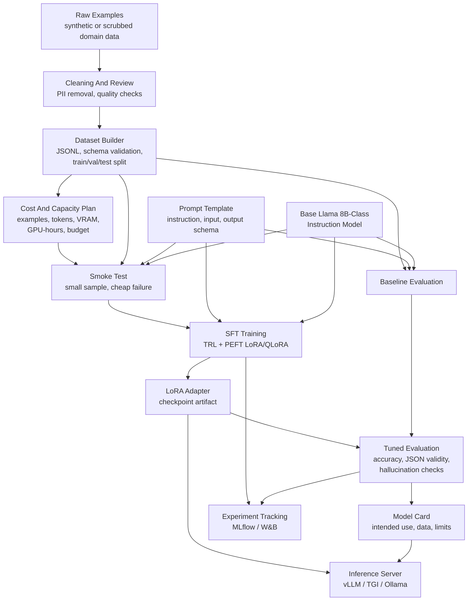

# Fine-Tuning Pipeline

## Flow Summary

1. Raw examples are cleaned, reviewed, and scrubbed.
2. Dataset builder validates schema and creates train/validation/test splits.
3. Cost and capacity plan estimates examples, tokens, VRAM, GPU-hours, runtime, and budget.
4. Base model is evaluated before tuning.
5. A smoke test catches broken data or training config cheaply.
6. LoRA/QLoRA training creates a small adapter.
7. Tuned model is evaluated against the frozen test set.
8. Model card records intended use, limitations, metrics, and data notes.
9. Adapter is served with the base model through an inference server.

## Cost Control Gates

- Do not start a real training run before the smoke test succeeds.
- Do not scale dataset size before baseline metrics exist.
- Do not accept a tuned adapter without frozen test evaluation.
- Stop failed runs early when loss, JSON validity, or validation metrics show the configuration is broken.
