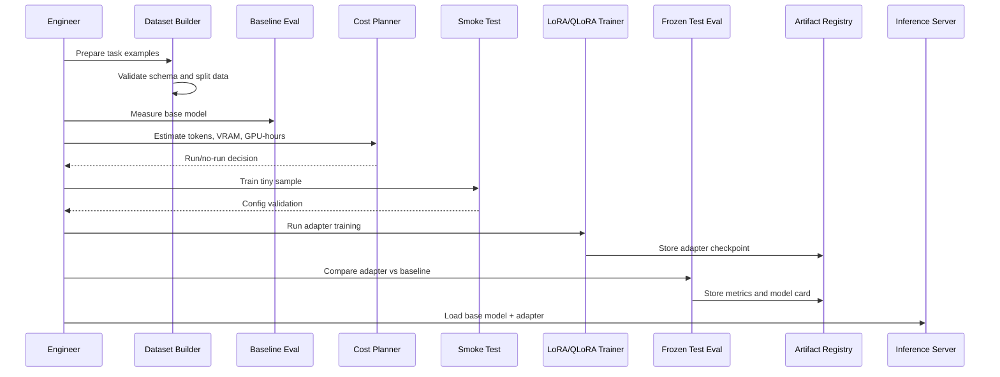

# Low-Level Design

## Key Controls

| Control | Purpose |
| --- | --- |
| Frozen test set | Prevent fake progress from overfitting. |
| Smoke test | Catch broken data or config cheaply. |
| Cost plan | Avoid uncontrolled GPU spend. |
| Model card | Document intended use, limits, and metrics. |
| Serving check | Confirm training format works at inference time. |
