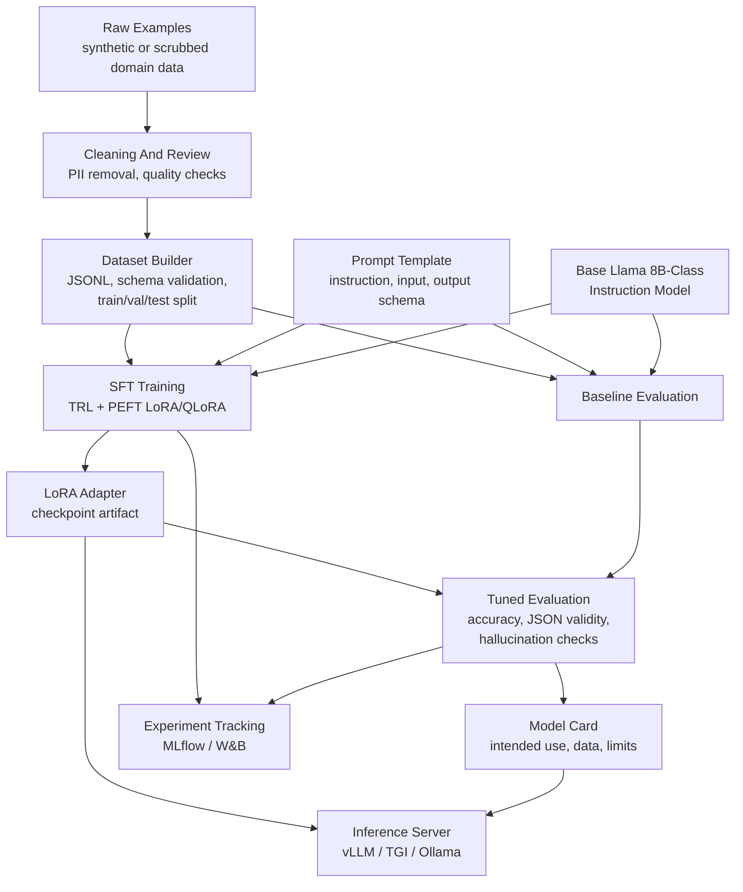

# Fine-Tuning Pipeline

## Flow Summary

1. Raw examples are cleaned, reviewed, and scrubbed.
2. Dataset builder validates schema and creates train/validation/test splits.
3. Base model is evaluated before tuning.
4. LoRA/QLoRA training creates a small adapter.
5. Tuned model is evaluated against the frozen test set.
6. Model card records intended use, limitations, metrics, and data notes.
7. Adapter is served with the base model through an inference server.

